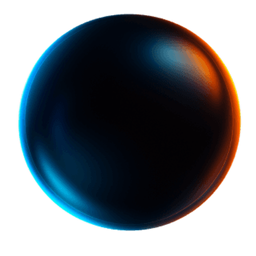
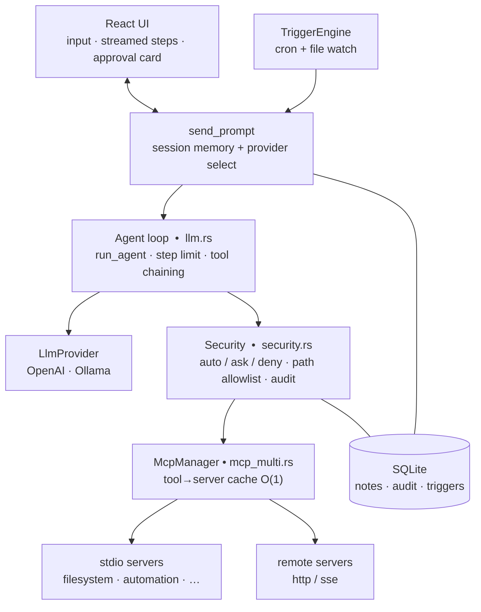

<div align="center">



# openMOON AI

### The open-source AI agent for macOS that actually *does* things.

**You say what you want. openMOON figures out the steps and executes them — using your apps, files and system — locally, privately, without the cloud.**

<br/>

[](LICENSE)
[](https://github.com/niceappspl/openmoon-ai)
[](https://tauri.app)
[](https://rustup.rs)
[](CONTRIBUTING.md)
[](https://github.com/niceappspl/openmoon-ai/actions)

<br/>

[Quick Start](#-quick-start) · [Features](#-features) · [MCP Servers](MCP.md) · [Architecture](#-architecture) · [Contributing](#-contributing) · [Roadmap](ROADMAP.md)

</div>

---

## What is openMOON?

openMOON is **not** a chatbot, a launcher, or a ChatGPT wrapper.

It's an **executive system agent** — a floating window that sits on top of your screen, understands natural language goals, and autonomously executes multi-step tasks using your Mac's apps, files and system capabilities — all through the [Model Context Protocol (MCP)](https://modelcontextprotocol.io).

```
You:     "Find the invoice email from last week and reply that I'll pay on Friday"

openMOON:  → searching Mail for invoice emails...
         → found: "Invoice #2847 from Acme Corp" (Nov 18)
         → drafting reply...
         ⚠️  Action requires approval: send_email to acme@corp.com
         [Approve] [Reject]
         → email sent.
```

Everything runs on your machine. No data leaves unless you choose cloud AI (OpenAI). [Ollama](https://ollama.com) works out of the box for fully offline use.

---

## Why openMOON?

| | Raycast AI | Claude Desktop | Open Interpreter | **openMOON** |
|---|---|---|---|---|
| Real agentic loop (multi-step) | ✗ | ✗ | ✓ | **✓** |
| Native macOS automation | ✓ | ✗ | ✗ | **✓** |
| Full MCP host (any server) | ✗ | ✓ | ✗ | **✓** |
| Local / offline (Ollama) | ✗ | ✗ | ✓ | **✓** |
| Security model + audit log | ✗ | ✗ | ✗ | **✓** |
| Open source | ✗ | ✗ | ✓ | **✓** |

---

## ✨ Features

<details>
<summary><strong>🔄 Real agentic loop</strong></summary>

Multi-step tasks from a single command. The model calls a tool, gets the result, decides the next step, and keeps going until the goal is reached — with a configurable step limit. Every step is streamed live to the UI.

```
prompt → [tool call] → result → [tool call] → result → ... → final answer
```
</details>

<details>
<summary><strong>🔌 Full MCP host — plug in any server</strong></summary>

openMOON is a complete [MCP](https://modelcontextprotocol.io) host. It runs local `stdio` servers and connects to remote `http`/`sse` servers (Streamable HTTP). Add a server in `config.json`, restart, and its tools are immediately available to the agent.

Ships with ~77 tools across 5 bundled servers — full list in [MCP.md](MCP.md):

| Server | What it controls |
|--------|-----------------|
| `automation` | Apps · system · network · display · power · Mail · Calendar · Messages · Reminders · Notes · Contacts |
| `filesystem` | Read · write · search · list |
| `productivity` | Tasks · Pomodoro timer · habit tracking |
| `browser` | Open URLs · tabs · bookmarks · web search |
| `media` | Music playback · screenshots · screen recording |

</details>

<details>
<summary><strong>🧠 Local-first — run fully offline with Ollama</strong></summary>

Switch between OpenAI and [Ollama](https://ollama.com) in Settings at any time. With Ollama, nothing leaves your machine. The `LlmProvider` trait makes it easy to add more providers (Anthropic, Mistral, etc.).

</details>

<details>
<summary><strong>🔒 Security model with per-action approvals</strong></summary>

Every tool call is resolved against a policy before execution:

- `auto` — executes silently (read-only, media, app launch tools)
- `ask` — shows an **approval card** with the tool name, arguments, and risk level; waits for your click
- `deny` — always blocked

File-write, communication and system-control tools default to `ask`. Every decision is recorded in a SQLite audit log.

</details>

<details>
<summary><strong>⏰ Triggers — automation without babysitting</strong></summary>

Save any task as an automation and run it on a schedule (cron) or when a file changes. Trigger runs are fully autonomous — `ask` tools are auto-rejected so they never hang.

</details>

<details>
<summary><strong>💾 Workflows & session memory</strong></summary>

Turn a successful agent run into a reusable workflow with one click ("Save as workflow"). Re-run it later without another LLM round-trip. Per-window conversation history makes follow-up commands feel natural.

</details>

---

## 🚀 Quick Start

### Prerequisites

- macOS 13+
- [Node.js 18+](https://nodejs.org)
- [Rust (stable)](https://rustup.rs) — `curl --proto '=https' --tlsv1.2 -sSf https://sh.rustup.rs | sh`
- [Bun](https://bun.sh) — `brew install oven-sh/bun/bun` *(for the apple-mcp integration)*
- An [OpenAI API key](https://platform.openai.com/api-keys) **or** [Ollama](https://ollama.com) for local inference

### Install & run

```bash
git clone https://github.com/niceappspl/openmoon-ai.git
cd openmoon-ai
npm install
cp .env.example .env          # add your OPENAI_API_KEY
npm run tauri:dev
```

**That's it.** Press `Cmd+Shift+Space` to open openMOON, or click the 🌙 icon in the menu bar.

> **Want to run fully offline?** Install Ollama, run `ollama pull llama3.1`, and switch the provider to "Ollama" in Settings. No API key needed.

### Build a release `.app`

```bash
npm run tauri:build
# → src-tauri/target/release/bundle/macos/openMOON.app
```

---

## 🏗 Architecture



<details>
<summary>Project layout</summary>

```
openmoon/
├── src/                        # React + TypeScript frontend
│   ├── App.tsx                 # Main UI — prompt input, step streaming, approval card
│   ├── components/             # ApprovalCard, Settings, QuickActions, WorkflowRunner …
│   ├── hooks/                  # useMcp, useApps, useWindowManager …
│   └── utils/
├── src-tauri/src/
│   ├── main.rs                 # Tauri commands, tray icon, window setup, global shortcut
│   ├── llm.rs                  # Agent loop + LlmProvider trait (OpenAI / Ollama)
│   ├── mcp_multi.rs            # MCP host — stdio + http/sse, O(1) routing cache
│   ├── security.rs             # Policy engine + path allowlist + audit log
│   ├── triggers.rs             # Cron scheduler + file watcher
│   ├── settings.rs             # Persisted settings
│   ├── db.rs                   # SQLite — notes, audit, triggers
│   └── ollama.rs               # Ollama provider
├── mcp-servers/
│   ├── automation/             # ~40 macOS automation tools
│   ├── filesystem/             # File operations
│   ├── productivity/           # Tasks, Pomodoro, habits
│   ├── browser/                # Browser control
│   ├── media/                  # Media playback & capture
│   ├── config.json             # Active server list (git-ignored, copy from example)
│   └── config.example.json     # Template — safe to commit
├── .github/workflows/ci.yml
└── .env.example
```

</details>

---

## ⚙️ Configuration

| File | What to put there |
|------|------------------|
| `.env` | `OPENAI_API_KEY=sk-…` (copy from `.env.example`) |
| `mcp-servers/config.json` | Which MCP servers to run — see `config.example.json` |
| Settings panel (in-app) | Provider, model, Ollama URL, security policies, triggers |

App data lives in `~/Library/Application Support/openMOON/`.

**Adding any MCP server takes 5 lines:**

```json
// mcp-servers/config.json
{
  "mcpServers": {
    "my-tools": {
      "command": "node",
      "args": ["mcp-servers/my-tools/index.js"],
      "description": "My custom tools"
    }
  }
}
```

Restart the app — the server starts automatically and all its tools are instantly available to the agent.

---

## 🤝 Contributing

**openMOON is actively looking for contributors.** Whether you're a Rust developer, TypeScript/React developer, or just someone who wants to help — there's something for you.

> [!TIP]
> The best way to start is to **open an issue** describing what you want to work on. That way we can discuss the approach before you write any code.

### Good first issues

| Area | Ideas |
|------|-------|
| 🔌 MCP servers | Add integrations: Slack, GitHub, Notion, Linear, Spotify … |
| 🎨 UI / UX | Improve the response display, add keyboard shortcuts, onboarding & provider setup |
| 🪟 Cross-platform | Research Windows / Linux support (Tauri supports both) |
| ⚡ Triggers | Webhook trigger, system-event trigger (network change, app launch) |
| 🤖 Models | Better Ollama compatibility, model picker, token counter |
| 📖 Docs | Improve docs, add video demo, write tutorials |

### How to contribute

```bash
# 1. Fork and clone
git clone https://github.com/YOUR_USERNAME/openmoon-ai.git

# 2. Create a branch
git checkout -b feat/my-feature

# 3. Make changes, then verify
npm run build
cd src-tauri && cargo fmt && cargo clippy && cargo test

# 4. Open a Pull Request against main
```

Read [CONTRIBUTING.md](CONTRIBUTING.md) for the full guide — code conventions, MCP server checklist, and the security policy.

---

## 🗺 Roadmap

Phases 1–3 (agentic loop, local inference, security model, triggers) are **done**.
We're now in Phase 4 — open source release — and planning Phase 5: ecosystem, cross-platform, and community growth.

→ **[See the full roadmap](ROADMAP.md)**

---

## 🛠 Tech stack

Tauri 2 · Rust · React 18 · TypeScript · Tailwind CSS · async-openai · rusqlite · tokio · notify · MCP (JSON-RPC over stdio / Streamable HTTP) · Cocoa (macOS native APIs)

---

## 👤 Author

Built by **[Marcin Jarzębowski](https://github.com/niceappspl)** — [jarzebowski.marcin@gmail.com](mailto:jarzebowski.marcin@gmail.com)

If openMOON is useful to you, a ⭐ on GitHub goes a long way — it helps others find the project.

---

## License

[MIT](LICENSE) © 2026 Marcin Jarzębowski
